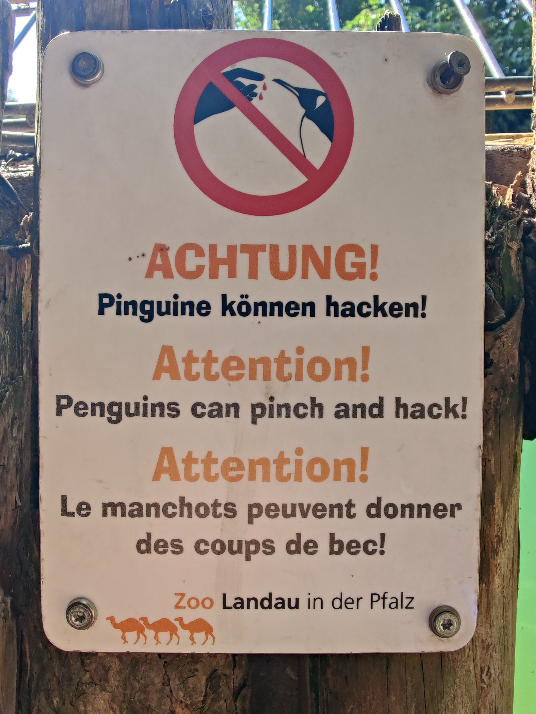

[Home](/) | [Verein](verein.html) | [Kontakt](kontakt.html) | [Impressum](impressum.html)

Wir sind ein klei&shy;ner aber fei&shy;ner ge&shy;mein&shy;nützi&shy;ger Ver&shy;ein in Lan&shy;dau in der Pfalz. Unsere Mit&shy;glieder be&shy;schäf&shy;ti&shy;gen sich mit dem Be&shy;triebs&shy;sys&shy;tem Li&shy;nux und frei&shy;er und offener Soft&shy;ware. Uns geht es da&shy;rum, uns ge&shy;gen&shy;sei&shy;tig und auch in&shy;ter&shy;essier&shy;ten Nicht-Mit&shy;glie&shy;dern zu hel&shy;fen, Linux auf ihrem Com&shy;pu&shy;ter zu ver&shy;wen&shy;den.

## Was wir machen
Neben den regelmäßigen Treffen (siehe unten) unterstützen oder organisieren wir Veranstaltung wie den [Macherdaach](https://macherdaa.ch){:target="_blank"} oder den *Linux Info Tag*.

## Termine/Treffen

Unsere regelmäßigen Vereinstreffen finden 1x im Monat statt, immer um 19:00 Uhr. Meistens treffen wir uns in einem Restaurant in Landau, aber auch gelegentlich in den Räumen des [ZTL.space](https://ztl.space){:target="_blank"} (Zentrum für Technikkultur Landau). Wir bemühen uns, zu den meisten Treffen ein interessantes Thema oder einen Vortrag zu organisieren. Da geht es dann um Linux- oder verwandte Themen aus dem Bereich Soft- und Hardware.

### Termine 2024
Das sind die __voraussichtlichen__ Termine 2024. Wie immer abwechselnd Mittwochs und Donnerstags, abwechseln in einer Kneipe in Landau und im ZTL, dann mit Vortrag. Der Abstand der Termine beträgt nicht immer genau 4 Wochen, das verschiebt sich manchmal um eine Woche. Dies geschieht um Terminkollisionen mit der Raumbelegung im ZTL zu vermeiden. Durchaus möglich, das sich der eine oder andere Termin noch etwas verschiebt, Info kommt dann hier und per Mailingliste. Wie immer suchen wir Vortragende für kleine interessante Themen rund um Linux! Freiwillige vor!

* Mi, 17. Jul 2024 (19:00 Uhr, Seven Spices, Königstraße 20, Landau)
* Do, 15. Aug 2024 (ZTL, mit Vortrag)
* Mi, 11. Sep 2024 (Kneipe)
* Do, 17. Okt 2024 (ZTL, mit Vortrag)
* Mi, 20. Nov 2024 (Kneipe)
* Do, 19. Dez 2024 (ZTL, mit Vortrag)

## Wir unterstützen die Pinguine im Landauer Zoo und die können häcken

