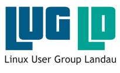

[Home](/) | [Verein](verein.html) | [Kontakt](kontakt.html) | [Impressum](impressum.html)

Wir sind ein klei&shy;ner aber fei&shy;ner ge&shy;mein&shy;nützi&shy;ger Ver&shy;ein in Lan&shy;dau in der Pfalz. Unsere Mit&shy;glieder be&shy;schäf&shy;ti&shy;gen sich mit dem Be&shy;triebs&shy;sys&shy;tem Li&shy;nux und frei&shy;er und offener Soft&shy;ware. Uns geht es da&shy;rum, uns ge&shy;gen&shy;sei&shy;tig und auch in&shy;ter&shy;essier&shy;ten Nicht-Mit&shy;glie&shy;dern zu hel&shy;fen, Linux auf ihrem Com&shy;pu&shy;ter zu ver&shy;wen&shy;den.

## Was wir machen
Neben den regelmäßigen Treffen (siehe unten) unterstützen oder organisieren wir Veranstaltung wie den [Macherdaach](https://macherdaa.ch){:target="_blank"} oder den *Linux Info Tag*.

## Termine/Treffen

Unsere regelmäßigen Vereinstreffen finden 1x im Monat statt, immer um 19:00 Uhr. Meistens treffen wir uns in einem Restaurant in Landau, aber auch gelegentlich in den Räumen des [ZTL.space](https://ztl.space){:target="_blank"} (Zentrum für Technikkultur Landau). Wir bemühen uns, zu den meisten Treffen ein interessantes Thema oder einen Vortrag zu organisieren. Da geht es dann um Linux- oder verwandte Themen aus dem Bereich Soft- und Hardware.

* Do. 20.04.23 ([Ristorante Milano](https://osm.org/go/0DP1PemdG?node=861670241){:target="_blank"})
* Mi. 17.05.23 (ZTL, mit Vortrag)
* Do. 15.06.23 (Kneipe)

